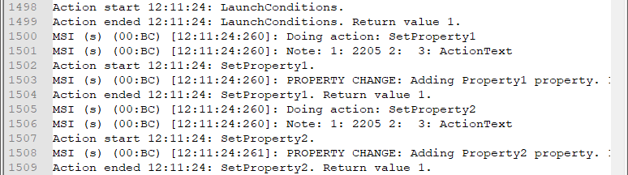
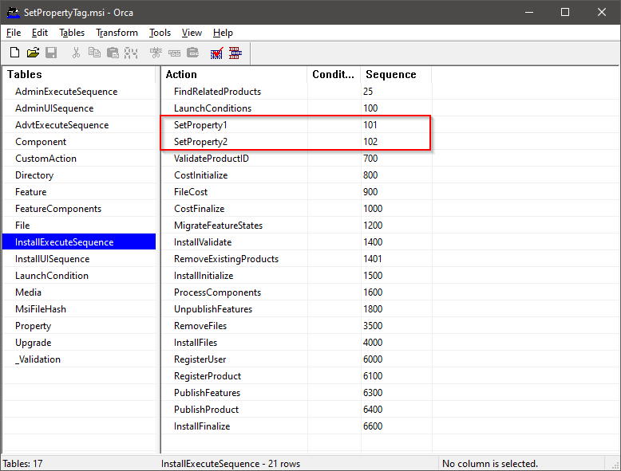
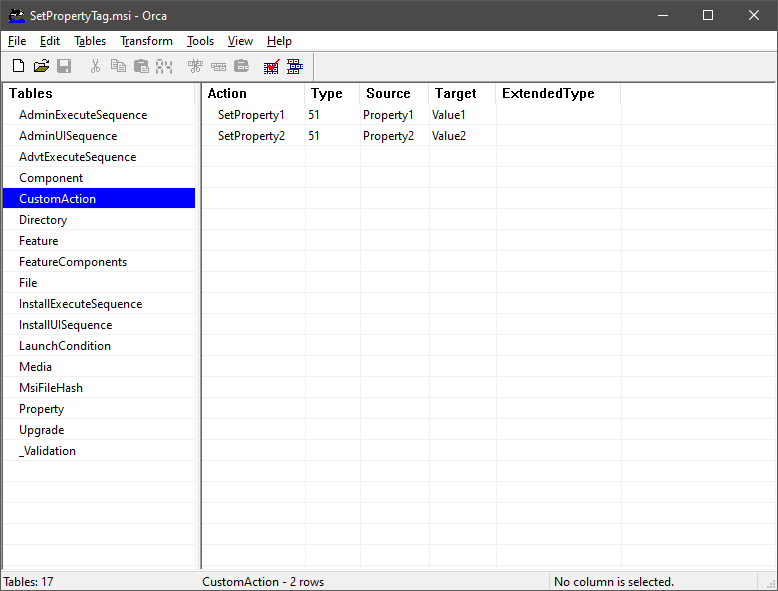

# `<SetProperty>` Tag

## Description

The `<SetProperty>` tag is just a syntactic sugar for a custom action that sets a property.

Behind the scene:

- Creates a custom action that sets the specified property.
- Adds the custom action into an execution sequence based on the values provided by the "Sequence", "After" and "Before" attributes.

Let's create an installer and set two properties. One of them using the `<SetProperty>` tag and the other one using a `<CustomAction>`.

## Implementation

### Step 0 - Create a dummy installer

Create a simple installer project that deploys a single dummy file. Let's call the project `SetPropertyTag`.

For more details regarding on how to do this, please see the tutorial:

- [My First Installer](https://github.com/WiX-Toolset-Pills-15mg/My-First-Installer)

### Step 1: Use `<SetProperty>` to set the value of `Property1`

As a first step let's set the `Property1` property using the `<SetProperty>` tag.

```xml
<SetProperty
    Id="Property1"
    Value="Value1"
    Sequence="execute"
    After="LaunchConditions" />
```

This tag will create a custom action with the name `SetProperty1` and place it into the `InstallExecuteSequence`, after the `LaunchConditions` as it is specified by the `Sequence` and the `After` attributes.

### Step 2: Use `<CustomAction>` to set the value of `Property2`

Let's set the value of another property, `Property2` using the `<CustomAction>` tag.

```xml
<CustomAction
    Id="SetProperty2"
    Property="Property2"
    Value="Value2" />
```

This time, we need to manually schedule it into an execution sequence. Let's put it in the same location where we scheduled the custom action for `Property1`: into the `InstallExecuteSequence`, after the `LaunchConditions`.

```xml
<InstallExecuteSequence>
    <Custom Action="SetProperty2" After="LaunchConditions" />
</InstallExecuteSequence>
```

### Step 3: Install the MSI

Install it normally:

```
msiexec /i SetPropertyTag.msi /l*vx install.log
```

#### The log file

After installing the MSI, look into the log file and search for the two custom actions that set the two properties. They should be executed after the `LaunchConditions`.



Notice that, excluding the name, there is no difference between the two executions.

#### Orca

Use Orca to inspect the MSI file.

The two custom actions are placed into the `InstallExecuteSequence`, after the `LaunchConditions`, one after the other.



In the `CustomAction` table we can see the two custom action:



Notice that, besides the name and the property being set, there is no difference between them.